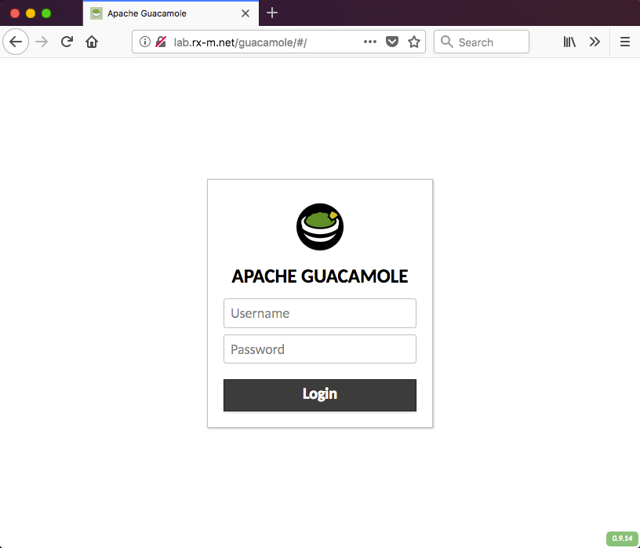
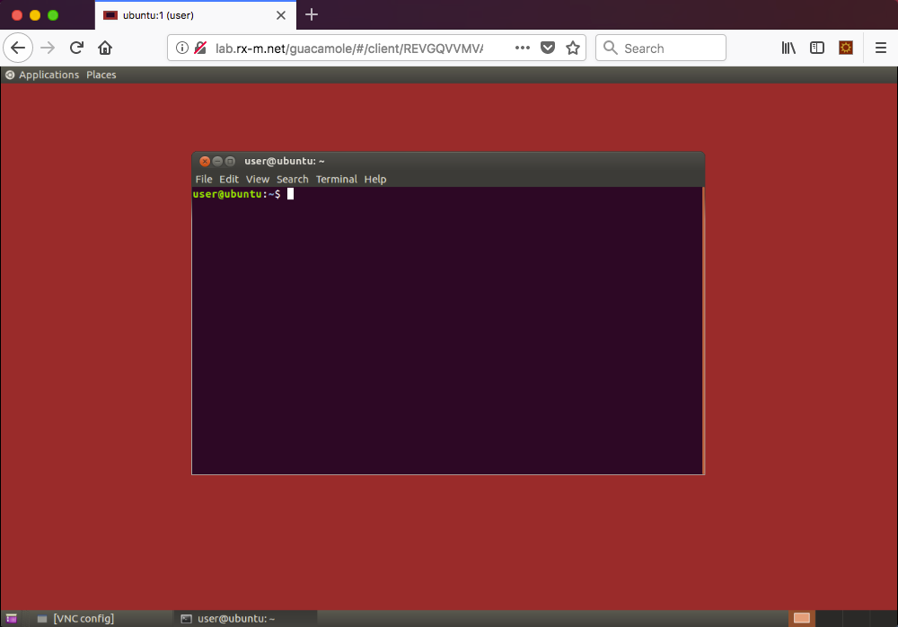

![RX-M LLC][RX-M LLC]

## RX-M Hosted Lab Environment

The RX-M hosted training lab allows students to access a lab environment over the internet using a web browser. The lab
environment is pre-configured to provide virtual machines that have unfettered access to cloud resources (GitHub repos,
cloud storage, RPMs, etc.) required for training. Each student is provided with a unique login and their own lab
environment in an Amazon Web Services (AWS) regional datacenter.

### RX-M hosted lab network requirements

Students will need access to http://lab.rx-m.net/guacamole/ which is a clientless remote desktop gateway powered by the
open source Apache Guacamole project and backed by an AWS Elastic Compute Cloud (EC2) virtual machine instance. From
this gateway, students will have access to the lab environment and any related resources associated with the training
class.

**NOTE**: The Guacamole gateway has been assigned a static IP address for stability but may change if the AWS region
where the lab is hosted needs to be changed. For example, the IP address normally used for the gateway is assigned to
the Ohio AWS region but if the class is held on another continent, say Europe, then the latency introduced by the
distance between the student(s) and the AWS Ohio datacenter may be too great, impacting student experience and
satisfaction. In such a case, the gateway would likely be moved to a datacenter more adjacent to students, changing the
IP (if required, the new IP would be provided to customers and/or partners for whitelisting and testing prior to
commencement of class).

### Connectivity testing

It’s highly recommended that students who plan to attend a training using the RX-M hosted lab test connectivity to the
lab environment prior to the start of class. To make sure that there is connectivity between the training site and the
hosted lab, students should run a connectivity test using the URL in these instructions. _This is the only setup
required_. The test will ensure that firewalls/proxies/filters/etc are not blocking your access to the remote lab
environment. If issues do arise, steps to remediate can be undertaken prior to the start of class.

The web gateway can be available for student system testing 5 business days prior to a class start date (Additional time
can be allowed upon request by customers/partners.)

#### Test steps

To access the RX-M hosted lab environment, use an HTML5-compatible browser, such as Firefox, Internet Explorer 10 or
higher, or Google Chrome

1. Open your Internet browser and go to http://lab.rx-m.net/guacamole/

 

 

2. Log in as `user` with the password `user`

 

 

Reaching the desktop with the active terminal window is a successful test. You may also try a simple command such as:
`ping -c 4 google.com` but it is not necessary to do so.

### Accessing the lab environment during class

On the first day of class the instructor will assign each student access credentials to log in to the virtual
environment.

 

_Copyright (c) 2018 RX-M LLC, Cloud Native Consulting, all rights reserved_

[RX-M LLC]: http://rx-m.io/rxm-cnc.svg "RX-M LLC"
